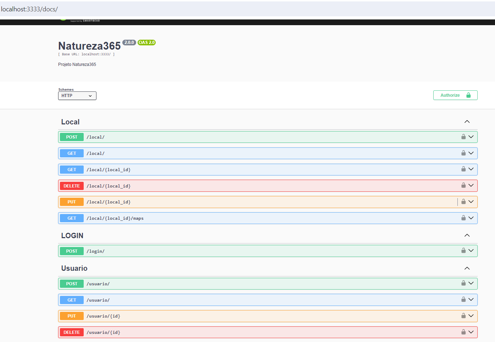

# Projeto - Natureza365 (Cite Natureza 🌱)

O Natureza365 é uma plataforma que permite aos usuários explorar e contribuir para a preservação da natureza, fornecendo acesso a informações sobre áreas naturais, trilhas, parques ecológicos, reservas ambientais e outros locais de interesse para os amantes da natureza. 

## Problemas que resolve

O natureza fornece aos seus usuários o exato local para se ir, por conta de além da localidade, o uso das coordenadas auxilia o melhor posicionamento da região desejada, ainda mais por se tratar de locais, muitas vezes afastadas.

## Melhorias que possa a ter

Interface gráfica; inserção de fotografias; possiblitar compartilhamento em outras plataformas; espaço para usuários compartilharem as experiências como dificuldade de chegar, perigos que possa ter na região, dicas de melhorias; separação do sistema por região (melhora na busca de locais), parceria com guias (para se ter melhor entendimento e locomoção), habilitar outras línguas para estrageiros poderem também ter um melhor acesso e dicas para se ter dicas de preservação e conscientização de cuidados com o meio ambiente e os animais que lá vivem(principalmente para evitar lixos, má interação e alimentação irregular com animais silvestres).

## Tecnologias utilizadas

O sistema foi desenvolvido utilizando Node, Express, PostgreSQL(banco de dados relacional) e Sequelize.

## Rodar o repositório:

### 🔧 Instalar as dependencias:
1. `npm install`
2. Em ambiente local: `npm install --dev`
3. `cp .env_example .env`

### Para rodar o repositório em ambiente local
`npm run start`

## Migrations

### Criar uma migration
`sequelize migration:generate --name tabela-usuarios`

### Rodar uma migration
`sequelize db:migrate`

### Reverter a última migration:
`sequelize-cli db:migrate:undo`

## Trabalhando com Seeders

### Criar um seeders 
`sequelize seed:generate --name seeders-usuarios`

### Criar valores iniciais no banco de dados:
`sequelize db:seed:all`

### Reverter o último seed:
`sequelize db:seed:undo`

## Trabalhando com Documentação:

### Gerar o documento do Swagger.json usando o AutoGen

1. `npm run swagger`
2. Acessar a interface no `locahost:3333/docs/`

interface do swagger: É possível realizar testes do sistema por meio deste

## Bibliotecas utilizadas:

### instalar o express
`npm i express --save`
### instalar o sequelize
`npm i sequelize`
### instalar o CLI do sequelize
`npm i -g sequelize-cli` 
### instalar o driver do PostgreSQL
`npm i pg` 
### instalar o dotenv
`npm i dotenv`
### instalar nodemon
`npm i nodemon --dev`
### instalar o JsonWebToken ( JWT )
`npm i jsonwebtoken`
### instalar o axios
`npm i axios`
### instalar o Swagger UI
`npm i swagger-ui-express`
### instalar o Swagger AutoGen para gerar o documento Swagger de forma automatica.
`npm i swagger-autogen`

## Documentações:

### [ExpressJS](https://expressjs.com/en/starter/installing.html)
### [Sequelize](https://sequelize.org/docs/v6/core-concepts/model-basics/)
### [Migrations e Seeders](https://sequelize.org/docs/v6/other-topics/migrations/)
### [Swagger](https://swagger-autogen.github.io/docs/getting-started/quick-start)
### [JWT - JSON WEB TOKEN](https://www.npmjs.com/package/jsonwebtoken)

## Feito por: Geovanna Barros